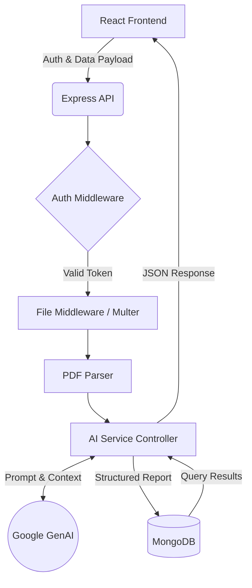
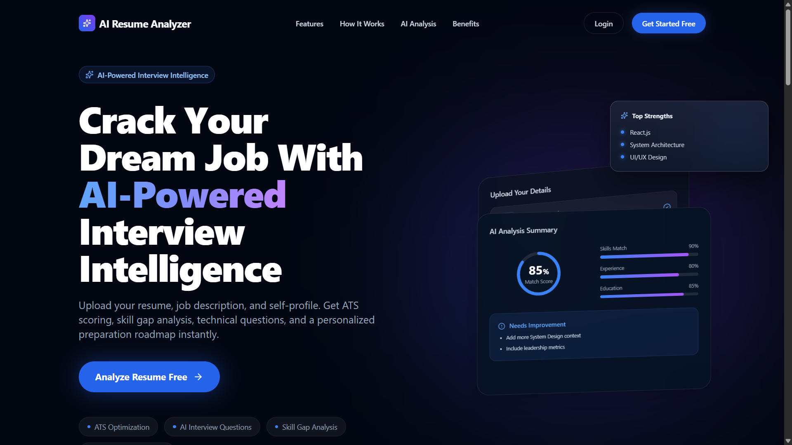
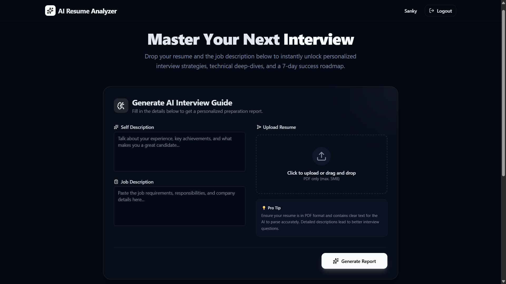
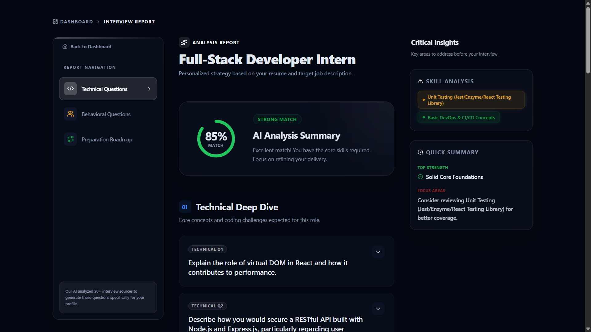
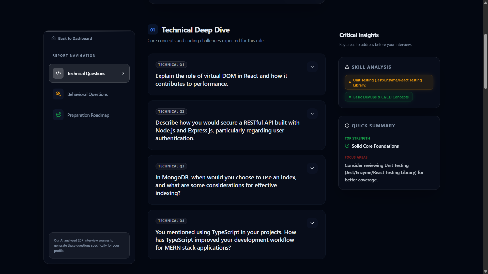

# 🚀 AI Resume Analyzer & Interview Prep Platform

> **Supercharge your career with AI-driven resume analysis and personalized interview preparation.**

AI Resume Analyzer is a production-grade web application that leverages advanced generative AI (Google Gemini) to analyze resumes against job descriptions and provide tailored technical interview preparation. This platform solves the real-world problem of bridging the gap between a candidate's current resume and the specific requirements of their dream job, offering actionable insights and dynamically generated interview questions to maximize chances of success.


---

## 📺 Demo & Screenshots

> **Live Demo:** https://ai-resume-analyzer-nine-drab.vercel.app


---

## ✨ Features

### 🔐 Authentication
*   **Secure Email/Password Login & Registration** (Bcrypt + JWT)
*   **Google OAuth Integration** for seamless onboarding
*   **Cookie-based Session Management** for enhanced security
*   **Protected Routes** and robust middleware validation

### 📄 Resume Analysis & Interview Prep
*   **PDF Resume Upload & Parsing:** Robust extraction of text from PDF files.
*   **AI-Powered Analysis:** Utilizes Google GenAI to evaluate the resume against a target job description.
*   **Match Scoring & Skill Gap Analysis:** Identifies strengths and areas for improvement.
*   **Personalized Interview Questions:** Generates technical and behavioral questions tailored to the candidate's profile and the job role.
*   **Preparation Plan:** Actionable steps to improve the candidate's profile.

### 🎨 UI/UX Design
*   **Modern SaaS Dashboard:** Clean, intuitive interface inspired by top-tier SaaS products.
*   **Responsive Design:** Fully mobile-friendly layout.
*   **Interactive Elements:** Smooth animations powered by Framer Motion.
*   **Comprehensive Loading & Error States:** Graceful handling of API delays and failures.

### 🛡️ Security & Performance
*   **Rate Limiting:** Protects backend endpoints against brute-force attacks.
*   **Zod Schema Validation:** End-to-end type safety and payload validation.
*   **Secure File Handling:** Safe upload and processing of PDF files using Multer.
*   **Optimized API Responses:** Efficient data fetching and JSON parsing.

---

## 🛠️ Tech Stack

| Category | Technologies |
| :--- | :--- |
| **Frontend** | React (v19), Vite, Tailwind CSS, Framer Motion, React Router v7, React Hook Form, Zod, Lucide React, Axios |
| **Backend** | Node.js, Express.js, MongoDB, Mongoose, Multer, PDF-Parse, JWT, Cookie-Parser, Express-Rate-Limit, Bcrypt.js |
| **AI Integration** | Google GenAI API (`@google/genai`), Prompt Engineering, Structured JSON Generation |

---

## 📐 Project Architecture

### Data Flow Overview

1.  **Client-Side Request:** User submits their resume (PDF), self-description, and target job description via the React frontend.
2.  **API Gateway & Middleware:** The Express server receives the request. `auth.middleware` verifies the JWT cookie. `file.middleware` (Multer) securely handles the PDF upload.
3.  **Parsing & AI Processing:** `pdf-parse` extracts text from the resume. The backend constructs a highly detailed prompt combining the extracted text, job description, and user input, sending it to the **Google GenAI API**.
4.  **Data Storage:** The AI returns structured JSON containing scores, skill gaps, and interview questions. This report is saved in MongoDB via Mongoose.
5.  **Client Response:** The frontend receives the comprehensive report and renders it dynamically using interactive charts and cards.



---

## 📁 Folder Structure

### Backend Architecture
```text
backend/
├── src/
│   ├── app.js                 # Express app setup & middleware configuration
│   ├── server.js              # Server entry point & DB connection
│   ├── config/                # Database configuration
│   ├── constants/             # Application-wide constants
│   ├── controllers/           # Route logic (Auth, Interview)
│   ├── middlewares/           # Auth, File upload, Rate limiting
│   ├── models/                # Mongoose Schemas (User, Report, Blacklist)
│   ├── routes/                # API Route definitions
│   ├── services/              # External integrations (AI, Google OAuth)
│   └── utils/                 # Helper functions (Token generation)
```
*Why it scales:* The backend strictly adheres to the Controller-Service-Route architecture, separating concerns and making the codebase modular and testable.

### Frontend Architecture
```text
frontend/
├── src/
│   ├── App.jsx                # Main application wrapper
│   ├── app.routes.jsx         # Routing configuration
│   ├── assets/                # Static assets (images, svgs)
│   ├── features/              # Feature-based modular structure
│   │   ├── auth/              # Authentication logic, context, components, pages
│   │   ├── interview/         # Interview report generation, components, pages
│   │   └── landing/           # Landing page UI & animations
│   ├── lib/                   # Utility functions & Axios instances
│   └── style.css              # Global styles & Tailwind configuration
```
*Why it scales:* The frontend utilizes a feature-driven architecture. Grouping components, hooks, and services by feature (e.g., `auth`, `interview`) prevents folder bloat and encapsulates logic.

---

## ⚙️ Installation Guide

### Prerequisites
*   Node.js (v18 or higher)
*   MongoDB (Local or Atlas)
*   Google Gemini API Key
*   Google OAuth Credentials (optional)

### 1. Clone Repository
```bash
git clone https://github.com/your-username/AIResumeAnalyzer.git
cd AIResumeAnalyzer
```

### 2. Backend Setup
```bash
cd backend
npm install

# Create environment variables (see below)
cp .env.example .env

# Start development server
npm run dev
```

### 3. Frontend Setup
```bash
cd frontend
npm install

# Create environment variables (see below)
cp .env.example .env

# Start development server
npm run dev
```

### 4. Environment Variables

**Backend (`backend/.env`)**
```env
# Server Configuration
PORT=3000
CLIENT_URL=http://localhost:5173

# Database
MONGO_URI=mongodb://127.0.0.1:27017/airesumeanalyzer

# Authentication
JWT_SECRET=your_super_secret_jwt_key
GOOGLE_CLIENT_ID=your_google_oauth_client_id

# AI Integration
GEMINI_API_KEY=your_google_gemini_api_key
```

**Frontend (`frontend/.env`)**
```env
# API Configuration
VITE_API_BASE_URL=http://localhost:3000
VITE_GOOGLE_CLIENT_ID=your_google_oauth_client_id
```

---

## 📡 API Routes Documentation

### Auth Routes
| Method | Endpoint | Description | Protected |
| :--- | :--- | :--- | :---: |
| `POST` | `/api/auth/register` | Register new user via email/password | ❌ |
| `POST` | `/api/auth/login` | Login user and set JWT cookie | ❌ |
| `POST` | `/api/auth/google` | Google OAuth registration/login | ❌ |
| `GET` | `/api/auth/get-user` | Retrieve logged-in user details | ✅ |
| `POST` | `/api/auth/logout` | Clear cookie & blacklist token | ✅ |

### Interview Routes
| Method | Endpoint | Description | Protected |
| :--- | :--- | :--- | :---: |
| `POST` | `/api/interview` | Upload PDF & generate AI report | ✅ |
| `GET` | `/api/interview` | Get all generated reports for user | ✅ |
| `GET` | `/api/interview/:id` | Get specific interview report details | ✅ |

---

## 📸 Screenshots


| Landing Page | Dashboard |
| :---: | :---: |
|  |  |

| AI Analysis Report | Interview Questions |
| :---: | :---: |
|  |  |

---

## 🔒 Security Practices

*   **HTTP-Only Cookies:** JWT tokens are stored securely in HTTP-only cookies, mitigating XSS attacks.
*   **Token Blacklisting:** Allows for true stateless logout by blacklisting active JWTs.
*   **Password Hashing:** Passwords are mathematically salted and hashed using `bcryptjs` before DB storage.
*   **Input Validation:** `Zod` schemas strictly validate incoming request bodies (frontend & backend).
*   **Rate Limiting:** `express-rate-limit` prevents brute-force attacks on authentication endpoints.
*   **File Upload Safety:** `multer` middleware sanitizes and restricts uploads to PDF formats.

---

## ⚡ Performance Optimizations

*   **Vite Build System:** Extremely fast HMR and optimized production bundling for React.
*   **Component-Level Architecture:** Limits unnecessary re-renders in complex UI components.
*   **Efficient PDF Parsing:** In-memory extraction of text directly from buffers without saving temporary files to disk.
*   **Tailwind CSS:** Purges unused CSS in production, resulting in tiny stylesheet sizes.

---

## 🚀 Future Roadmap

### Short-Term
*   [ ] Implement interactive mock interviews using text/voice.
*   [ ] Add a cover letter generation module based on the analyzed job description.
*   [ ] Introduce robust tracking of application statuses.

### Long-Term
*   [ ] Integrate RAG (Retrieval-Augmented Generation) for company-specific interview prep.
*   [ ] WebRTC Voice integration for real-time AI interviewing.
*   [ ] Analytics dashboard mapping user growth over time.

---

## 🧠 Challenges & Learnings

Building this application provided deep insights into full-stack architecture and AI integration:
1.  **AI Prompt Engineering:** The biggest challenge was ensuring consistent, structured JSON responses from the LLM. I resolved this by tightly defining the expected schema in the prompt and utilizing structured output features.
2.  **State Management & Auth:** Transitioning from local storage JWTs to HTTP-only cookies required a deeper understanding of CORS policies and cross-origin credential handling.
3.  **PDF Processing:** Handling file buffers securely and efficiently in Node.js, ensuring that memory limits weren't exceeded during concurrent user uploads.


---

## 🤝 Contributing

Contributions are always welcome!
1. Fork the project.
2. Create your feature branch (`git checkout -b feature/AmazingFeature`).
3. Commit your changes (`git commit -m 'Add some AmazingFeature'`).
4. Push to the branch (`git push origin feature/AmazingFeature`).
5. Open a Pull Request.

---

## 📄 License

Distributed under the MIT License. See `LICENSE` for more information.

---

## 👨‍💻 Author

**Sanket Nagap**

[](https://www.linkedin.com/in/sanket-nagap/)
[](https://github.com/SanketTheCodeCrafter)
[](mailto:sanket.nagap3@gmail.com)